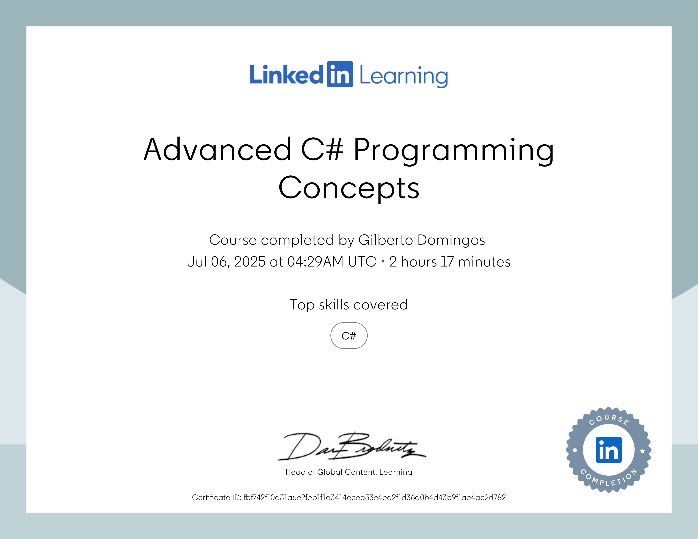

# Conceitos avançados de programação em C# (.NET) por Joe Marini
Technology Industry Veteran

- Ocupou cargos de destaque em diversas empresas do Vale do Silício, incluindo Microsoft, Adobe, Google e Databricks.

- Joe Marini tem mais de 35 anos de experiência no setor de tecnologia é autor de diversos livros e mais de 40 cursos educacionais sobre desenvolvimento de software.

- Conheça Joe Marini : https://www.linkedin.com/in/joemarini/?trk=lil_instructor

### Advanced C# Programming Concepts
This is the repository for the LinkedIn Learning course `Advanced C# Programming Concepts`. The full course is available from LinkedIn Learning.

![lil-thumbnail-url]

## Course Description

Explore modern language features and development patterns in this advanced skills course on C#. Instructor Joe Marini guides you through sophisticated programming techniques including C# indexers, pattern matching, and improved syntax for enhanced code readability. In addition, he covers critical topics such as delegates, events, lambda expressions, and interfaces, equipping you with comprehensive skills for creating more flexible and efficient code. Through practical examples, you’ll get a chance to master custom type manipulation and advanced object-oriented programming concepts like deconstruction syntax, null-coalescing operators, and custom type comparisons.

This course is integrated with GitHub Codespaces, an instant cloud developer environment that offers all the functionality of your favorite IDE without the need for any local machine setup. With GitHub Codespaces, you can get hands-on practice from any machine, at any time—all while using a tool that you’ll likely encounter in the workplace. Check out “Using GitHub Codespaces" with this course to learn how to get started.

This course also includes Code Challenges powered by CoderPad. Code Challenges are interactive coding exercises with real-time feedback, so you can get hands-on coding practice alongside the course content to advance your programming skills.

[0]: # (Replace these placeholder URLs with actual course URLs)

[lil-course-url]: https://www.linkedin.com/learning/advanced-c-sharp-programming-concepts
[lil-thumbnail-url]: https://media.licdn.com/dms/image/v2/D4E0DAQEAwibW5-phug/learning-public-crop_675_1200/B4EZdCHJEiHQAk-/0/1749160858554?e=2147483647&v=beta&t=Z2_SIdNFNvT28MoXjnWKAxG-0xtnYZPzI0gZXY1n6V4

# Conceitos avançados de programação em C# (.NET)

## Conteúdo do Curso

### 1. Recursos Avançados da Linguagem

- Indexadores e intervalos 
- Indexadores de classe 
- Operador de coalescência nula 
- Desconstrução com tuplas 
- Desconstrução com classes 
- Melhorias em literais numéricos 
- Code Live - Desafio de código: Desconstrução
- Quiz do capítulo (11 questões)

### 2. Correspondência Estrutural de Padrões 

- Visão geral da correspondência de padrões
- Padrões básicos
- Instruções aprimoradas
- Padrões posicionais
- Padrões relacionais
- Code Live - Desafio de código: Padrões
- Quiz do capítulo (12 questões)

### 3. Delegados

- Delegados anônimos
- Delegados compostos
- Code Live - Desafio de código: Delegados
- Quiz do capítulo (8 questões)

### 4. Eventos

- Manipuladores de eventos em C#
- Encadeamento de eventos
- Code Live - Desafio: Eventos
- Quiz do capítulo (8 questões)

### 5. Funções Lambda

- Visão geral de funções lambda
- Lambdas como delegados
- Code Live - Desafio: Funções lambda
- Quiz do capítulo (9 questões)

### 6. Interfaces

- Interfaces e conversões
- Múltiplas interfaces
- Interfaces explícitas
- Interfaces definidas pelo .NET
- Code Live - Desafio de código: Interfaces
- Quiz do capítulo (9 questões)

